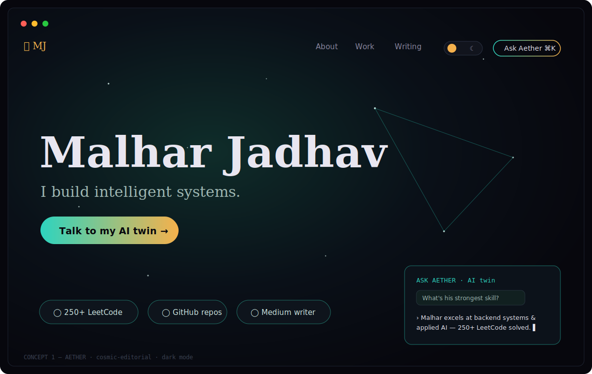
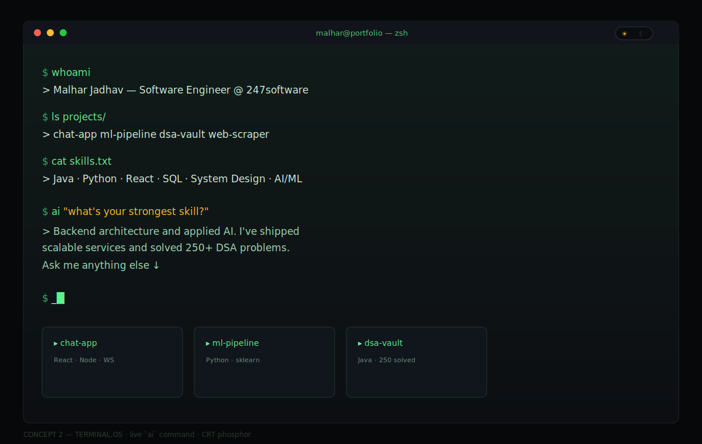
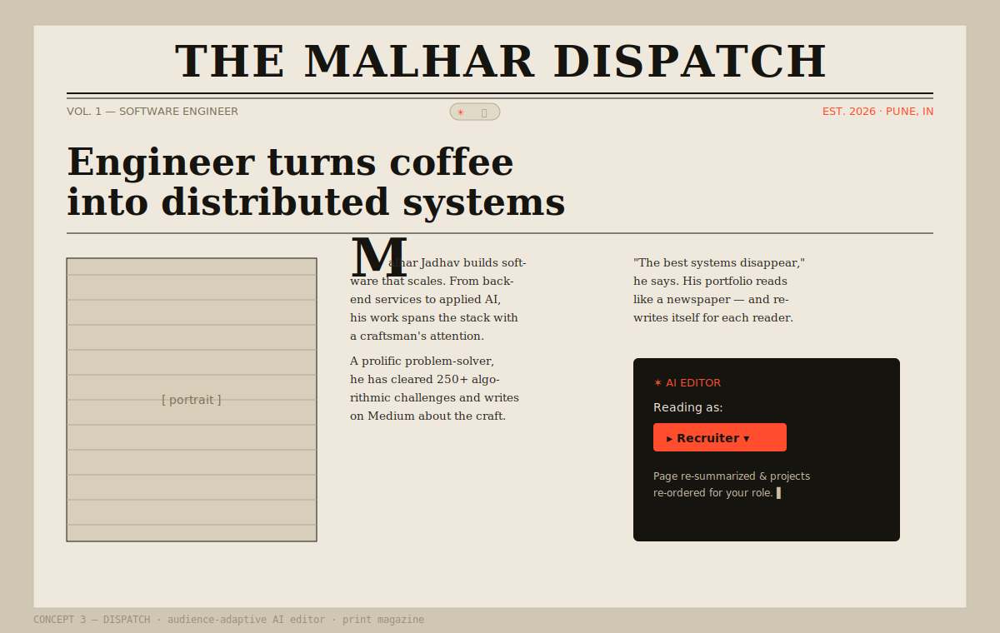
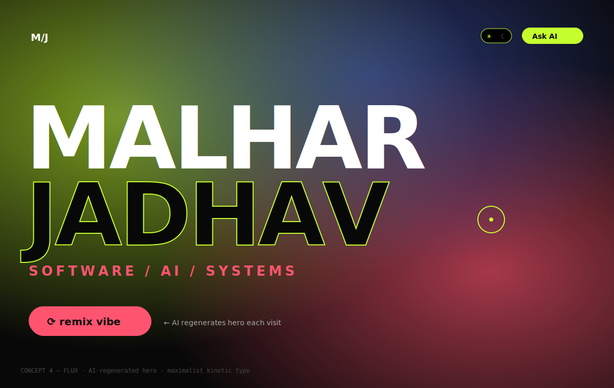
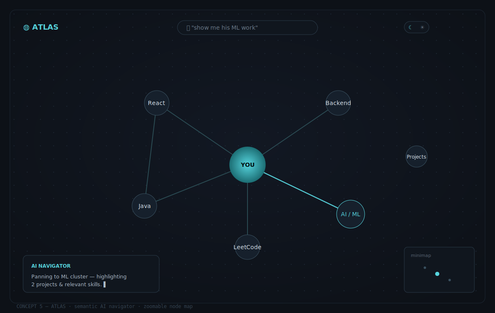
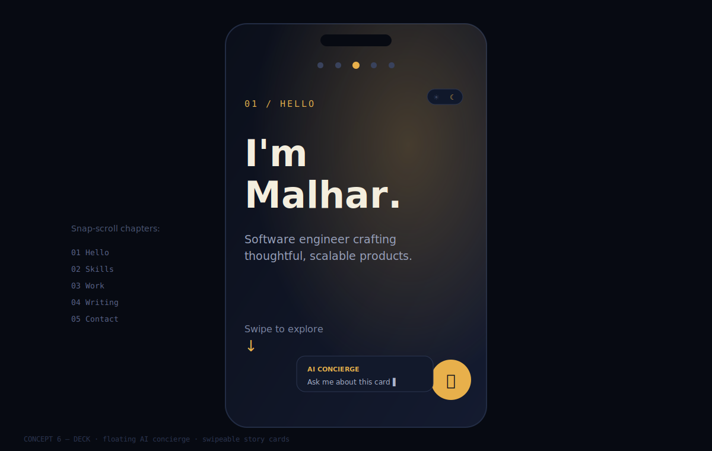

# 🛰️ Malhar Jadhav — Portfolio Concepts

> Pick ONE direction (or mix-and-match). Each is **AI-integrated**, has **dark/lite mode (sun/moon radio toggle)**, and is built with **React + Tailwind + shadcn + Framer Motion**.
>
> Reply with the number you want (e.g. *"build #2"*) and I'll scaffold the full project.

---

## ⭐ Concept 1 — "AETHER" · The AI Twin Observatory



**Vibe:** Cosmic-editorial. The whole site is a night-sky observatory you explore.
**Signature:** An AI dock **"Ask Aether"** (`⌘K`) — visitors chat with an AI *version of you* trained on your data. Recruiters can literally interview you at 2am.

**Aesthetic**
- Dark = deep-space ink `#07070d` + aurora **teal** `#2dd4bf` + star **amber** `#f5b14c`
- Light = warm bone/blueprint paper `#f3efe6` + deep teal + ink
- Fonts: **Fraunces** (serif display) · **Satoshi** (body) · **JetBrains Mono**
- Living `<canvas>` constellation that links stars toward your cursor.

```
┌──────────────────────────────────────────────────────────┐
│  ✦ MJ          About  Work  Writing      ☀/☾   [Ask ⌘K]  │
├──────────────────────────────────────────────────────────┤
│        ·  ✦      ·         ·     ✦   ·                    │
│   ·        Malhar Jadhav              ·      ✦            │
│      ✦   I build intelligent systems.    ·               │
│   ·         ·     [ Talk to my AI twin → ]      ·         │
│        ·          ✦         ·        ·                    │
├──────────────────────────────────────────────────────────┤
│  ◯ 250+ LeetCode   ◯ N repos   ◯ Medium writer           │
└──────────────────────────────────────────────────────────┘
```
**Why it wins:** Almost nobody ships a working AI-twin. Unforgettable + practical.

---

## 🖥️ Concept 2 — "TERMINAL.OS" · Living Dev Console



**Vibe:** A bootable retro-future OS window. Part terminal, part GUI — toggle between a typed CLI and polished cards.
**Signature:** A real command line (`projects`, `whoami`, `ai "your question"`) where `ai` pipes into an LLM. Tab-complete, command history, the works.

**Aesthetic**
- Dark = CRT charcoal `#0c0e12` + phosphor **green** `#5ef38c` + scanline grain
- Light = "paper terminal" cream + ink-green
- Fonts: **JetBrains Mono** everywhere + **Space Mono** accents
- Boot sequence on load, blinking caret, glassy window chrome.

```
┌─ malhar@portfolio ── ─ ☀/☾ ─ ─ ─ ─ ─ ─ ─ ─ ─ ─ ─ □ ✕ ─┐
│ $ whoami                                               │
│ > Malhar Jadhav — Software Engineer @ 247software      │
│ $ ls projects/                                         │
│ > [████] repo-1   [████] repo-2   [████] repo-3        │
│ $ ai "what's your strongest skill?"                    │
│ > ▌ (AI typing...)                                     │
│ $ _                                                    │
└────────────────────────────────────────────────────────┘
```
**Why it wins:** Screams "developer." The `ai` command is a killer party trick.

---

## 📰 Concept 3 — "DISPATCH" · The Editorial Magazine



**Vibe:** A printed design magazine / newspaper about you. Big serif headlines, columns, pull-quotes, a masthead.
**Signature:** **"AI Editor"** — a sidebar assistant that *rewrites the page for the reader*: pick "I'm a Recruiter / Founder / Engineer" and AI re-summarizes your bio + reorders projects for that audience.

**Aesthetic**
- Dark = ink-on-newsprint inverted `#16140f` + **vermillion** `#ff4d2e`
- Light = aged-paper `#efe9dd` + black ink + red accent
- Fonts: **Playfair Display / Fraunces** headlines · **Newsreader** body
- Drop caps, hairline rules, halftone image treatment, grain.

```
╔══════════════ THE MALHAR DISPATCH ══════ Vol.1 ☀/☾ ══╗
║  "Engineer turns coffee into distributed systems"      ║
║ ┌─────────────┐  Lorem developer ipsum builds at      ║
║ │   PORTRAIT  │  scale. Drop-cap E ditorial body text  ║
║ │   halftone  │  flows in columns like a real paper... ║
║ └─────────────┘  ─────────────────────────────────     ║
║  [ Reading as: ▸ Recruiter ▾ ]  ← AI re-writes page    ║
╚════════════════════════════════════════════════════════╝
```
**Why it wins:** Audience-adaptive content is genuinely smart and rare.

---

## 🌌 Concept 4 — "FLUX" · Generative Maximalist



**Vibe:** Bold, loud, motion-heavy. Big type that breaks the grid, magnetic buttons, a WebGL/shader gradient mesh that warps on scroll.
**Signature:** An **AI-generated hero** — the background gradient + a tagline regenerate live ("remix" button calls AI for a new vibe each visit). Custom cursor, scroll-jacked sections.

**Aesthetic**
- Dark = obsidian `#080808` + electric **lime** `#c5ff2e` + hot **coral** `#ff5470`
- Light = off-white + same neon accents (high energy)
- Fonts: **Clash Display** (huge) · **Satoshi** body
- Animated noise, blur layers, kinetic typography.

```
┌────────────────────────── ☀/☾ ── [Ask AI] ──┐
│  M A L H A R                                  │
│        ▒▒▒▒ gradient mesh warps on scroll ▒▒  │
│   J A D H A V                  ↘ magnetic     │
│  ──────────────  software / ai / systems      │
│  [ ⟳ remix vibe ]  ← AI regenerates hero      │
└───────────────────────────────────────────────┘
```
**Why it wins:** Maximum "wow" in 3 seconds. Best if you want pure impact.

---

## 🗂️ Concept 5 — "ATLAS" · Spatial Skill Map



**Vibe:** Calm, refined, Notion-meets-Linear. An interactive node graph of skills/projects you pan & zoom, like exploring a map.
**Signature:** **AI Navigator** — type a goal ("find his ML work") and the map auto-pans, highlights relevant nodes, and narrates. Semantic search over your work.

**Aesthetic**
- Dark = slate `#0d1117` + soft **cyan** `#56d4dd` glow nodes
- Light = fog-white + muted ink, dotted-grid canvas
- Fonts: **General Sans** display · **Satoshi** body
- Spring-physics drag, connecting edges, minimap.

```
┌─────────────────────── ☀/☾ ─ [⌕ Ask Atlas] ──┐
│        (React)──(TypeScript)                  │
│           \         |                         │
│   (AI/ML)──●YOU●──(Backend)──(Java)           │
│           /         |                         │
│      (Projects)──(LeetCode)                   │
│   ⌕ "show ML work" → map pans + glows         │
└───────────────────────────────────────────────┘
```
**Why it wins:** Interactive, explorable, shows breadth as a system.

---

## 🎴 Concept 6 — "DECK" · Swipeable Story Cards



**Vibe:** Mobile-first storytelling. Full-screen vertical "cards" you scroll/swipe through like a deck — each is one chapter (intro → skills → a project → contact).
**Signature:** **AI Concierge** bubble that floats across cards, answering questions contextually about whatever card you're on.

**Aesthetic**
- Dark = midnight indigo `#0b0f1a` + warm **gold** `#e8b04b`
- Light = porcelain + indigo ink
- Fonts: **Bricolage Grotesque** display · **Satoshi** body
- Snap-scroll, parallax layers, progress rail.

```
┌──────────────── ☀/☾ ──┐   ● ○ ○ ○ ○  (rail)
│   01 / HELLO           │
│                        │
│   I'm Malhar.          │
│   Swipe to explore ↓   │
│                        │
│            (💬 AI bubble follows you)
└────────────────────────┘
```
**Why it wins:** Best on phones (where recruiters often open links).

---

## 🧭 Quick comparison

| # | Name | Mood | AI feature | Build effort | Best for |
|---|------|------|-----------|-------------|----------|
| 1 | **AETHER** | Cosmic-editorial | Chat with your AI twin | Medium | Standing out + recruiters |
| 2 | **TERMINAL.OS** | Retro dev console | `ai` CLI command | Medium | Proving you're a dev |
| 3 | **DISPATCH** | Print magazine | Audience-adaptive rewrite | Medium-High | Storytelling |
| 4 | **FLUX** | Loud maximalist | AI-regenerated hero | High | Pure wow factor |
| 5 | **ATLAS** | Calm node-map | Semantic AI navigator | High | Showing breadth |
| 6 | **DECK** | Swipe cards | Floating AI concierge | Low-Medium | Mobile-first |

---

### 👉 My top pick for you: **#1 AETHER** or **#2 TERMINAL.OS**
You're a developer with LeetCode + GitHub + a Medium blog — both lean into that identity while the **AI twin / `ai` command** is the thing nobody forgets.

**Reply with the number** (e.g. `build 1`) and I'll generate the full working project. Want me to combine two? Say so (e.g. *"AETHER look + TERMINAL ai command"*).
